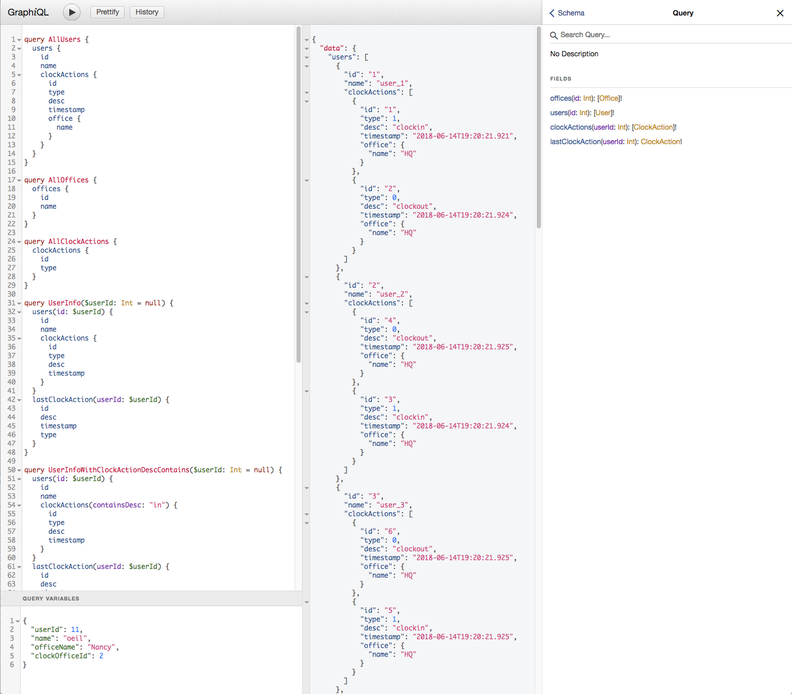

# Standalone App(web) demonstrating Springboot, Kotlin, GraphQL and Hazelcast tech stack all together

This branch uses Tomcat embedded as web-server (via springboot), GraphQL web services (in addition to REST) and :fire: **Hazelcast** :fire: as datastore (clustering support out-of-the box).

You can spin-off multiple instances of this app to get data replaction of the store seamlessly. Each instance is automatically 'active', which means you can query (via GraphQL or REST) on either one - it just works.

## Build Project
```
mvn clean package
```
## Get Started
Get a built pre-release [here](https://github.com/oeil/kotlin-springboot-skeleton/releases/tag/untagged-7b3d510a25eaa7bfbe71)

###### Run one Application Instance on port 8080 (for REST & GraphQL endpoints)
```
java -jar -Dport=8080 -Dstore=hazelcast target/kotlin-springboot-skeleton-1.0.1-SNAPSHOT.jar
```

###### Run second Application Instance (on port 9090) & generate initial data (100 offices, 100 users, 10 clock in/out actions per user. Data get sync automatically across all other running instances (local or remote on same network)
```
java -jar -Dport=9090 -Dstore=hazelcast -DgenData="offices:100|users:100|actions:10" target/kotlin-springboot-skeleton-1.0.1-SNAPSHOT.jar
```

###### GraphQL Playground on current schema (powered by GraphiQL)
```
http://localhost:8080/graphiql
```
###### Make use of the "Docs" link on top right corner. The playground support intellisense/auto-completion against GraphQl schema



# GraphQL usage examples on provided Schema
### Query Users and ask for Id and Name for each:
```
{
  users {
    id
    name
  }
}
```

### Query Users and ask for Id and Name for each, with Paging (first page of 5 rows):
```
{
  users(paging:{offset:0, limit:5}) {
    id
    name
  }
}
```

### Query Users with associated ClockActions (including associated Office name per ClockAction):
```
users {
    id
    name
    clockActions {
      id
      type
      desc
      timestamp
      office {
        name
      }
    }
  }
```

### Query User for Id=1 with associated ClockActions (including associated Office name per ClockAction):
```
users(id: 1) {
    id
    name
    clockActions {
      id
      type
      desc
      timestamp
      office {
        name
      }
    }
  }
```

### Generate Data : 10 offices, 10 users, 10 clock in&out actions per user
```
mutation {
  genData(offices: 10, users: 10, clockActions: 10)
}
```

### Add new user name="oeil" and return its generated id
```
mutation {
  user(name: "oeil") {
    id
  }
}
```

### Add office user name="Nancy" and return its generated id and name
```
mutation {
  office(name: "Nancy") {
    id
    name
  }
}
```

### Clock User In for userId=1 and officeId=1
```
mutation {
  clockIn(userId: 1, officeId: 1) {
    id
    type
    timestamp
    desc
    office {
      name
    }
  }
}
```
### Clock User Out for userId=1 and officeId=1
```
mutation {
  clockOut(userId: 1, officeId: 1) {
    id
    type
    timestamp
    desc
    office {
      name
    }
  }
}
```
